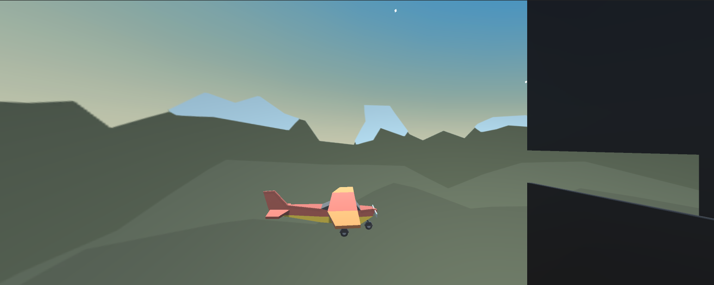
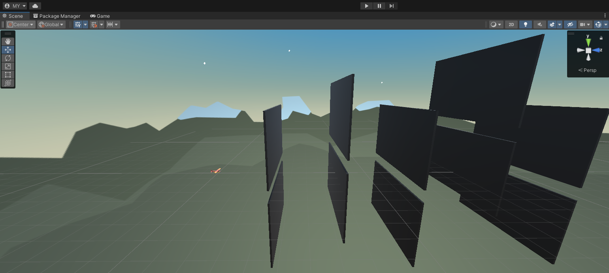

# ✈️ Unity Flight Challenge – Plane Pitch Simulation

This Unity project is a simple **airplane control simulation** designed to teach the basics of 3D flight mechanics. The player can pitch the plane up and down using the arrow keys. While the plane continuously flies forward, a camera follows alongside to provide a dynamic third-person view.

---

## 📸 Screenshots

### 🎮 Game View:

### 🛠️ Scene View:

---

## 🎯 Challenge Overview

Take your ground-based vehicle simulation skills to the skies!  
In this challenge, you’ll use **up/down arrow key inputs** to control an airplane's pitch mid-air and implement a camera system that follows the plane from a side perspective.

---

## 🚀 Challenge Outcome

### 🛩️ Flight Features:
- The plane moves forward at a constant speed using `Transform.Translate` and `Time.deltaTime`.
- Player Input:
  - **↑ Up Arrow:** Tilts the plane’s nose upward (pitch up)
  - **↓ Down Arrow:** Tilts the plane’s nose downward (pitch down)

### 🎥 Camera Follow:
- The camera is positioned to the side of the plane and follows it dynamically.
- A custom `CameraFollow` script keeps the camera at a fixed offset from the plane.

---

## 📦 Features

- Airplane model and basic control system
- Sky obstacles placed for maneuvering challenges
- Dynamic camera follow system
- `Input.GetAxis("Vertical")` for user input detection
- Rotation handled via `Transform.Rotate`
- Frame-rate-independent movement using `Time.deltaTime`

---

## 🧠 Key Concepts Learned

- Airplane-style pitch control using rotation
- Side-following camera systems
- Reading user input with `Input.GetAxis`
- Smooth movement with `Time.deltaTime`
- Using transform operations: `Translate`, `Rotate`

---

## 🗂️ Project Structure
